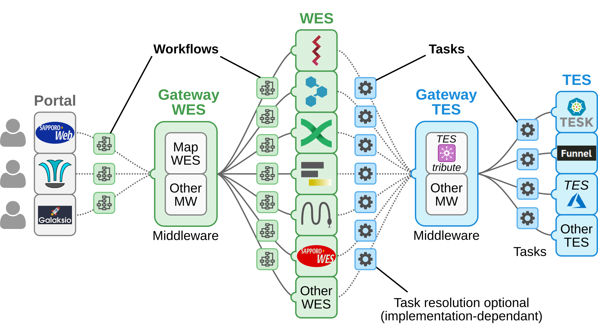

# ELIXIR Cloud & AAI

[![License][badge-license]][badge-url-license]
[![Chat][badge-chat]][badge-url-chat]

Welcome to the GitHub presence of the [ELIXIR Cloud and Authentication &
Authorization Infrastructure (AAI)][elixir-cloud] project.

[![Resources][button-resources]][elixir-cloud-resources][![Contribute][button-contribute]][contributing]

## Who we are

[![logo-elixir-cloud][logo-elixir-cloud]][elixir-cloud]
[![logo-elixir][logo-elixir]][elixir]
[![logo-ga4gh][logo-ga4gh]][ga4gh]

- We are a [Driver Project][ga4gh-driver-projects] of the [**Global Alliance
for Genomics and Health**][ga4gh] (GA4GH), an international organization
developing policies and technical standards to enable the responsible sharing
of sensitive data across international boundaries. As such, the majority of our
work is directly related to either the implementation or the further
development/framing of these policies and standards, in particular those
handled by the following [GA4GH Work Streams][ga4gh-work-streams]:
  - [Cloud][ga4gh-cloud-ws]
  - [Data Security][ga4gh-data-security-ws]
  - [Data Use and Researcher Identity][ga4gh-duri-ws]

- We are also a subgroup of [**ELIXIR**][elixir], a multinational Europe-based
initative that unites life science laboratories and organizations to establish
a common infrastructure that supports and integrates scalable, sustainable
bioinformatics and data analysis services for member states and beyond. Within
the ELIXIR network, we are responsible for leveraging a common cloud
computing infrastructure in line with international community standards. ELIXIR
is a [strategic partner][ga4gh-elixir] of the Global Alliance for Genomics and
Health.

## Our mission

[ELIXIR Cloud & AAI][elixir-cloud] develops services towards establishing a
federated [cloud computing][cloud-computing] network that enables the analysis
of population-scale genomic and phenotypic data across participating,
international nodes.

## Our solutions

***This section is still in an early stage - check back soon!***

> **Note:** Implementations & services shown here are just for reference and
> include both currently unavailable (and possibly _unplanned_)
> implementations, as well as ones developed by independent organizations. We
> are not endorsing nor are being endorsed by any external organization.

- [cwl-WES][present-cwl-wes]
- [TEStribute][present-testribute]

## Our audience

Our solutions will have **benefits for multiple stakeholders** in the handling
and analysis of personalized health and other big data. Key benefits for each
target audience are listed below.

Click on the **chat** button at the top of the page to get in touch with us and
discuss how you can be among the first to make use of our products!

> Note that the listed points reflect our vision for the years 2025 and beyond.
> Moreover, for several of them we will require help by other [GA4GH work
> streams][ga4gh-work-streams] and the corresponding implementers. See the
> section on [FAIRness](#fair-infrastructure) for more info on that. Also have
> a look at GA4GH's [strategic roadmap][ga4gh-roadmap].

### Data analysts, experimentalists & healthcare practicioners

- Analyze your data in the cloud - no need to install anything or buy and
  maintain expensive IT infrastructure!
- Bring your own data or analyze available data sets - safely and securely!
- Select from a wide range of available workflows - or just use your own! Or
  perhaps you don't deal with workflows but are looking for a solution to run
  individual compute jobs on cloud infrastructure? Sure, that's possible, too!
- Reproduce your analysis with just a few button clicks to increase your
  confidence - or why not reproduce _other people's_ analysis to build on top
  of it?
- Tired of collecting metadata about your data and analyses? Our products help
  in digitizing and, to some extent, automating a lot of this work!
  
### Workflow engine developers

- You would like to write a new workflow engine but are scared of having to
  implement compute backends for a wide array of diverse IT infrastructure
  solutions? Or you already wrote one but have a hard time to maintain your
  compute backends and keep up with the technologies? Our tools allow you to
  focus on writing the code that interpretes your workflows, generates your
  DAGs and schedules execution - by (almost) _any_ backend! Talk to us about
  implementing a TES client for your product.
- You would like to increase your user base and make it easy for people to
  run workflows in your language? Talk to us about implementing a WES shim
  around your new or existing engine.

### IT infrastructure specialists & system administrators

- You are developing IT compute infrastructure solutions and you would like to
  increase their adoption? Talk to us about implementing a TES shim around your
  prodcuts and allow them to be hooked up to the federated compute networks
  that we help to build - and which we project will handle a lot of the big
  data analysis in the personalized medicine sector and beyond!
- You are managing a compute cluster or data center at a university, hospital,
  research center or in a company? Talk to us about implementing or deploying
  a TES or DRS instance to add your nodes or data to the network. Consumers of
  our services will be able to access them without hassle!

## FAIR infrastructure

***Section coming soon!***

## Projects we support

We provide services and technical support for the following projects and
initiatives, which in turn test our products and drive future development.
Check out the links for more details:

- [1+ Million Genomes][million-genomes] initative
- [ELIXIR Human Data][elixir-human-data] community
- [ELIXIR Marine Metagenomics][elixir-marine-metagenomics] community
- [ELIXIR Rare Diseases][elixir-rare-diseases] community

## Collaborators

Apart from the [GA4GH Cloud][ga4gh-cloud-ws] community as a whole, we are
working together closely with the following projects that develop similar
services:

- [SAPPORO][collab-sapporo] project at [DNA Databank of Japan (DDBJ)][loc-ddbj], Japan

## Contact

[![Chat][badge-chat]][badge-url-chat]

Also see the [list of individual members][elixir-cloud-members] to see some
actual people involved in this project, including contact information.

[badge-chat]: <https://img.shields.io/static/v1?label=chat&message=Slack&color=ff6994>
[badge-license]: <https://img.shields.io/badge/license-Apache%202.0-blue.svg>
[badge-url-chat]: <https://join.slack.com/t/elixir-cloud/shared_invite/enQtNzA3NTQ5Mzg2NjQ3LTZjZGI1OGQ5ZTRiOTRkY2ExMGUxNmQyODAxMDdjM2EyZDQ1YWM0ZGFjOTJhNzg5NjE0YmJiZTZhZDVhOWE4MWM>
[badge-url-license]: <http://www.apache.org/licenses/LICENSE-2.0>
[button-contribute]: images/button-contribute.png
[button-resources]: images/button-resources.png
[cloud-computing]: <https://en.wikipedia.org/wiki/Cloud_computing>
[collab-sapporo]: <https://github.com/ddbj/SAPPORO>
[contributing]: CONTRIBUTING.md
[elixir]: <https://elixir-europe.org/>
[elixir-cloud]: <https://elixir-europe.github.io/cloud>
[elixir-cloud-members]: <https://elixir-europe.github.io/cloud/categories/people.html>
[elixir-cloud-resources]: resources/resources.md
[elixir-human-data]: <https://elixir-europe.org/communities/human-data>
[elixir-rare-diseases]: <https://elixir-europe.org/communities/rare-diseases>
[elixir-marine-metagenomics]: <https://elixir-europe.org/communities/marine-metagenomics>
[ga4gh]: <https://www.ga4gh.org/>
[ga4gh-cloud-ws]: <https://www.ga4gh.org/work_stream/cloud/>
[ga4gh-data-security-ws]: <https://www.ga4gh.org/work_stream/data-security/>
[ga4gh-driver-projects]: <https://www.ga4gh.org/how-we-work/driver-projects/>
[ga4gh-duri-ws]: <https://www.ga4gh.org/work_stream/data-use-researcher-identities-duri-2/>
[ga4gh-elixir]: <https://elixir-europe.org/news/elixir-and-ga4gh-expand-collaboration>
[ga4gh-roadmap]: <https://www.ga4gh.org/how-we-work/strategic-roadmap/>
[ga4gh-work-streams]: <https://www.ga4gh.org/how-we-work/workstreams/>
[loc-ddbj]: <https://www.ddbj.nig.ac.jp/index-e.html>
[logo-elixir]: images/logo-elixir.png
[logo-elixir-cloud]: images/logo-elixir-cloud.png
[logo-ga4gh]: images/logo-ga4gh.png
[million-genomes]: <https://ec.europa.eu/digital-single-market/en/european-1-million-genomes-initiative>
[present-cwl-wes]: <https://docs.google.com/presentation/d/1eEYJBzO6YaI8bREXzDIzCLkLFDqmESiDJz14ngAuiZU>
[present-testribute]: <https://docs.google.com/presentation/d/14IJRKejeqRNU9qVfssp9ugFtuV49ZpWf18cnoZoESKo>
