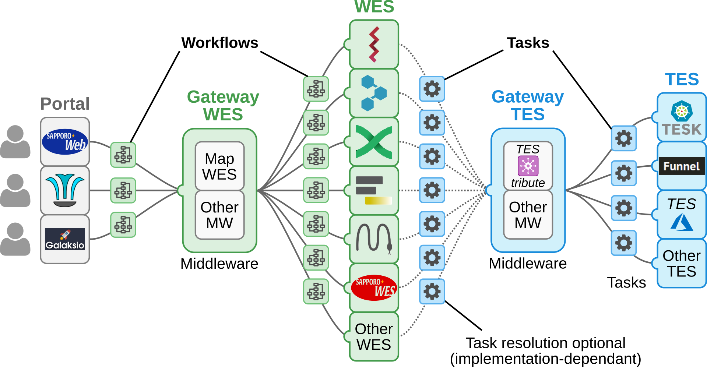

# ELIXIR Cloud & AAI service overview

## Synopsis

List of implementations, service instances and useful references relevant to
the ELIXIR Cloud and AAI group. See the [official
website](https://elixir-europe.github.io/cloud/) for more information.

## Interoperability scheme

> **Note:** Implementations & services shown here are just for reference and
> include both currently unavailable (and possibly _unplanned_)
> implementations, > as well as external ones. We are not endorsing nor are
> we being endorsed by any external group or organization.

## Repositories

### ELIXIR Cloud repositories

* [proWES](https://github.com/elixir-europe/proWES) # WIP
* [WES-ELIXIR](https://github.com/elixir-europe/WES-ELIXIR) # will be renamed to WES-CWL or something similar
* [proTES](https://github.com/elixir-europe/proTES)
* [TESK](https://github.com/EMBL-EBI-TSI/TESK)
* [TEStribute](https://github.com/elixir-europe/TEStribute)
* [mock-TES](https://github.com/elixir-europe/mock-TES)
* [mock-DRS](https://github.com/elixir-europe/mock-DRS)

### Collaborators

#### DNA Databank of Japan

* [SAPPORO](https://github.com/ddbj/SAPPORO)
* [SAPPORO-web](https://github.com/ddbj/SAPPORO-web)
* [SAPPORO-service](https://github.com/ddbj/SAPPORO-service)
* [SAPPORO-fileserver](https://github.com/ddbj/SAPPORO-fileserver)

## Deployed services

* [WES-ELIXIR @ CSC](http://193.167.189.73:7777/ga4gh/wes/v1/ui/)
* [proTES @ CSC](http://86.50.252.55:7878/ga4gh/tes/v1/ui/)
* [TEStribute @ CSC](http://vm2051.kaj.pouta.csc.fi:7979/ui/)
* [TEStribute @ CSC (OpenShift)](https://testribute-p1.c03.k8s-popup.csc.fi/ui/)
* [TESK 1 @ CSC (ELIXIR-AAI AuthN)](https://tesk.c01.k8s-popup.csc.fi/)
* [TESK 2 @ CSC](https://csc-tesk.c03.k8s-popup.csc.fi/)
* [TESK @ EBI](https://tes1.tsi.ebi.ac.uk/tes)
* [mock-TES @ Biozentrum](http://131.152.229.70/ga4gh/tes/v1/ui/)
* [mock-TES @ CSC](http://193.166.24.111/ga4gh/tes/v1/ui/)
* [mock-TES @ EBI](https://tes1.tsi.ebi.ac.uk/mock/ga4gh/tes/v1/ui/)
* [mock-DRS @ Biozentrum](http://131.152.229.71/ga4gh/drs/v1/ui/)
* [mock-DRS @ CSC](http://193.166.24.114/ga4gh/drs/v1/ui/)

## Presentations

* [TEStribute](https://docs.google.com/presentation/d/14IJRKejeqRNU9qVfssp9ugFtuV49ZpWf18cnoZoESKo)
* [WES-ELIXIR](https://docs.google.com/presentation/d/1eEYJBzO6YaI8bREXzDIzCLkLFDqmESiDJz14ngAuiZU)
